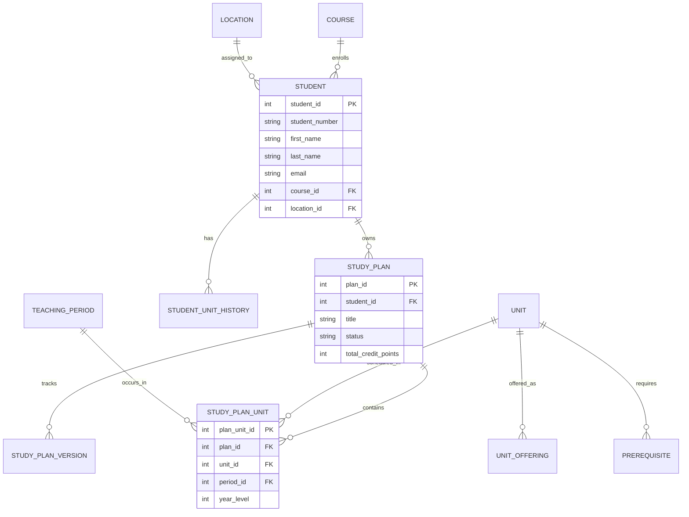

# 🎓 PT3 Solutions — Study Plan Repository (SPR)
> **ICT302 Outsource Development Final Deliverable & System Handover**  
> **Target Campus**: PT3 Solutions Singapore Campus  
> **Stack**: React 18 (Vite) + Node.js (Express REST API) + MySQL 8.0 / PostgreSQL 15 + Docker  

---

## 📌 Executive Summary
The **Study Plan Repository (SPR)** is an executive web application designed for **PT3 Solutions Academic Chairs** and **Students** to construct, validate, recommend, digitally sign, approve, and archive multi-year university study plans.

### Core Business Rules Enforced
- **BR-01 (Unit Offering Validation)**: Verifies whether proposed units are officially offered at the selected campus (Singapore Campus) and teaching period (e.g. Capstone `ICT302` restricted from Tri-Semester 3).
- **BR-02 (Prerequisite Validation)**: Ensures students have satisfied prerequisite units with passing grades (`P`, `C`, `D`, `HD`) before enrolling in advanced units.
- **Credit Point Load Control**: Enforces maximum **12 Credit Points per teaching period** limit with dynamic meter bars and warning banners.

---

## 🚀 Quick Start & Installation

### Option 1: One-Command Docker Launch (Recommended)
Make sure Docker Desktop is installed and running, then execute:
```bash
docker-compose up -d --build
```
Access the application at: **`http://localhost:3000`** (Backend API at `http://localhost:5000`).

### Option 2: Local Development Setup

#### 1. Backend Server
```bash
cd backend
npm install
cp ../.env.example .env
npm run dev
```

#### 2. Frontend Client
```bash
cd frontend
npm install
npm run dev
```
Open **`http://localhost:3000`** in your browser.

---

## 📁 Environment Configuration Template (`.env.example`)

```env
# Application Server Port
PORT=5000
NODE_ENV=production

# Database Connection (MySQL 8.0 / PostgreSQL 15)
DB_HOST=localhost
DB_PORT=3306
DB_USER=spr_user
DB_PASSWORD=your_secure_password_here
DB_NAME=spr_db

# Frontend Client Origin (CORS Configuration)
CLIENT_ORIGIN=http://localhost:3000
LOG_LEVEL=info
```

---

## 🏗️ Architecture & Component Design

```
+-----------------------------------------------------------------------+
|                             USER INTERFACE                            |
|             React 18 + Vite + TailwindCSS + @dnd-kit                  |
|   Navbar | PlanBuilder | AcademicHistory | StoredPlans | GuideModal   |
+-----------------------------------------------------------------------+
                                   |
                                REST API
                                   |
+-----------------------------------------------------------------------+
|                            BACKEND SERVICES                           |
|                       Node.js + Express.js API                        |
|  /api/students | /api/units | /api/periods | /api/validate | /api/plans |
+-----------------------------------------------------------------------+
                                   |
                                SQL DB
                                   |
+-----------------------------------------------------------------------+
|                           DATABASE LAYER                              |
|                    MySQL 8.0 / PostgreSQL 15                          |
|   Student | Course | Unit | UnitOffering | Prerequisite | StudyPlan   |
+-----------------------------------------------------------------------+
```

---

## 🗄️ Database Schema & ERD (Entity Relationship Diagram)

### Mermaid ERD Diagram


### SQL Migrations & Data Files
- **Database Schema**: [`database/schema.sql`](file:///d:/ProjectDesmondandTeam/database/schema.sql)
- **Seed Data**: [`database/seed.sql`](file:///d:/ProjectDesmondandTeam/database/seed.sql)

---

## 📊 Sample Registered Student Dataset (4 Students)

The system comes pre-seeded with 4 registered sample students in `StoredPlansView`:

| Student ID | Student Name | Course & Major | Status | Location |
|---|---|---|---|---|
| `PT3-2026-001` | **Alex Mercer** (Sample Student) | PT3-BSIT-01 Software & Systems | **APPROVED v2.0** | Singapore Campus |
| `PT3-2026-002` | **Sarah Jenkins** (Sample Student) | PT3-BSCS-02 Computer Science | **STUDENT AGREED v1.0** | Singapore Campus |
| `PT3-2026-003` | **Michael Chang** (Sample Student) | PT3-BSE-03 Software Engineering | **RECOMMENDED v1.0** | Singapore Campus |
| `PT3-2026-004` | **Emily Watson** (Sample Student) | PT3-BSCY-04 Cyber Security | **DRAFT v3.3** | Singapore Campus |

---

## 🧪 Test Evidence & Verification Matrix

| Test Case | Description | Requirement | Expected Result | Pass/Fail |
|---|---|---|---|---|
| **TC-01** | Drag capstone `ICT302` into Trimester 3 | BR-01 Offering | Warning banner: Unit not offered in T3 | **PASS** |
| **TC-02** | Add `ICT283` without completing `ICT167` | BR-02 Prerequisite | Warning banner: Prerequisite ICT167 unmet | **PASS** |
| **TC-03** | Schedule 5 units (15 CP) in single period | Max 12 CP Limit | Alert banner: Exceeds 12 CP limit | **PASS** |
| **TC-04** | Switch between Semester & Trimester mode | FR-05 Period Switch | Canvas updates grid layout smoothly | **PASS** |
| **TC-05** | Student Digital Sign-Off | FR-10 Sign-Off | Plan status updates to `STUDENT AGREED` | **PASS** |
| **TC-06** | Export Official Study Plan Document | FR-15 Document Export | Clean branded document modal opens | **PASS** |

---

## 🚢 Deployment Guide (PT03 Account Infrastructure)

1. **SSH to Server**: Log in to PT03 hosting server via SSH.
2. **Clone Codebase**:
   ```bash
   git clone https://github.com/jasonistioso-1/ProjectStudyPlanDesmond.git
   cd ProjectStudyPlanDesmond
   ```
3. **Configure Environment**:
   ```bash
   cp .env.example .env
   ```
4. **Deploy Containers**:
   ```bash
   docker-compose up -d --build
   ```
5. **Verify Live Endpoint**: Curl `http://localhost:3000` to confirm HTTP status 200 OK.

---

## 🤝 Handover & Codebase Walkthrough

- **Interactive In-App Guide**: Click **User Guide** in the top navigation bar to open full interactive documentation directly inside the application.
- **Clean Component Structure**:
  - `PlanBuilder.jsx`: Drag-and-Drop Study Plan canvas & validation engine.
  - `DroppablePeriod.jsx`: Column period droppable container with CP progress bar.
  - `DraggableUnitCard.jsx`: Reusable clean unit card.
  - `StoredPlansView.jsx`: Versioned archived study plans repository table.
  - `GuideModal.jsx`: Comprehensive tabbed in-app user & system guide.

---

*Prepared by Desmond & Development Team for PT3 Solutions — September 2026*
