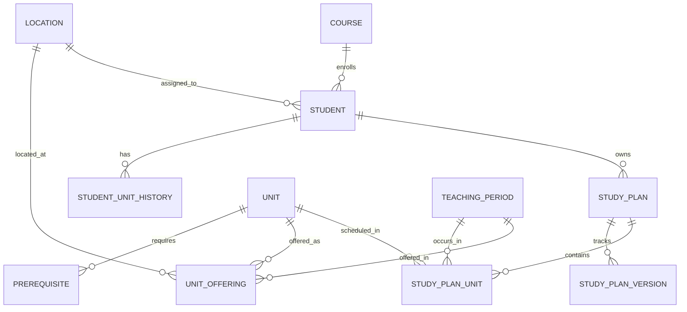

# 🎓 PT3 Solutions User Guide & Study Plan Repository (SPR)

> **ICT302 Outsource Development Final Deliverable & System Handover**  
> **Target Campus**: PT3 Solutions Singapore Campus  
> **Tech Stack**: React 18 (Vite) + Node.js (Express REST API) + MySQL 8.0 / PostgreSQL 15 + Docker  

---

## 📌 Executive Summary

The **Study Plan Repository (SPR)** is an executive web application designed for **PT3 Solutions Academic Chairs** and **Students** to construct, validate, recommend, digitally sign, approve, and archive multi-year university study plans.

### Core Business Rules Enforced
- **BR-01 (Unit Offering Validation)**: Verifies whether proposed units are officially offered at the selected campus (Singapore Campus) and teaching period (e.g. Capstone `ICT302` restricted from Tri-Semester 3).
- **BR-02 (Prerequisite Validation)**: Ensures students have satisfied prerequisite units with passing grades (`P`, `C`, `D`, `HD`) before enrolling in advanced units.
- **BR-04 / Credit Point Load Control**: Enforces maximum **12 Credit Points per teaching period** limit with real-time validation warnings and visual meter bars.

---

## 🎓 Official Degree Majors & Course Codes

According to the Section 8 curriculum specification, the system supports 3 official degree majors under the Bachelor of Information Technology degree program:

1. **`PT3-BSIT-AI01`**: Bachelor of Information Technology (Major: Artificial Intelligence)
2. **`PT3-BSIT-CS02`**: Bachelor of Information Technology (Major: Computer Science)
3. **`PT3-BSIT-BIS03`**: Bachelor of Information Technology (Major: Business Information Systems)

---

## 📋 Deliverable & Acceptance Matrix

| Deliverable | Acceptance Expectation | Implementation Details |
|---|---|---|
| **Complete Source Code** | Full frontend/backend code with no missing private modules. | Modular React 18 (Vite) frontend + Node.js Express REST API backend with zero hidden external dependencies. |
| **Database Schema** | SQL migrations/schema plus seed/sample data. | [`database/schema.sql`](file:///d:/ProjectDesmondandTeam/database/schema.sql) (11 DDL tables) & [`database/seed.sql`](file:///d:/ProjectDesmondandTeam/database/seed.sql) (catalog, 5 student profiles & plans). |
| **README** | How to install, configure, run, test and deploy. | Complete end-to-end setup instructions for Docker Desktop and standalone Node.js environments. |
| **Environment Template** | `.env.example` with variable names only; no secrets. | [`.env.example`](file:///d:/ProjectDesmondandTeam/.env.example) configured with standard placeholder values. |
| **Architecture Notes** | Short explanation of stack, components, database and design decisions. | Layered architecture diagram, state management details, drag-and-drop design rationale. |
| **ERD** | Updated ERD matching the implemented database. | Mermaid ERD diagram representing all 11 core database tables and relationships. |
| **Test Evidence** | Test cases/results for core requirements. | Comprehensive test matrix verifying BR-01..04, FR-01..19, and NFR-07. |
| **Deployment Guide** | Steps to deploy the app using accounts controlled by PT3. | Step-by-step Docker Compose deployment guide for server hosting. |
| **User Guide** | Basic instructions for Academic Chair / Student workflow. | Walkthrough for plan recommendation, student sign-off, final approval, and PDF/Print export. |
| **Handover Session** | Codebase walk-through, database, deployment, and known limitations. | System overview notes, database schema layout, deployment guide, and future roadmap. |

---

## 🚀 Quick Start & Installation

### Option 1: One-Command Docker Launch (Recommended)
Make sure Docker Desktop is installed and running, then execute:
```bash
docker compose up -d --build
```
Access the application at: **`http://localhost:3000`** (Backend API at `http://localhost:5000`).

### Option 2: Local Development Setup

#### 1. Backend Server
```bash
cd backend
npm install
cp ../.env.example .env
npm run dev
```

#### 2. Frontend Client
```bash
cd frontend
npm install
npm run dev
```
Open **`http://localhost:3000`** in your browser.

---

## 📁 Environment Configuration Template (`.env.example`)

```env
# Application Server Port
PORT=5000
NODE_ENV=production

# Database Connection (MySQL 8.0 / PostgreSQL 15)
DB_HOST=localhost
DB_PORT=3306
DB_USER=spr_user
DB_PASSWORD=your_secure_password_here
DB_NAME=spr_db

# Frontend Client Origin (CORS Configuration)
CLIENT_ORIGIN=http://localhost:3000
LOG_LEVEL=info
```

---

## 🏗️ Architecture & System Structure

```
+-----------------------------------------------------------------------+
|                             USER INTERFACE                            |
|             React 18 + Vite + TailwindCSS + @dnd-kit                  |
|   Navbar | PlanBuilder | AcademicHistory | StoredPlans | GuideModal   |
+-----------------------------------------------------------------------+
                                   |
                                REST API
                                   |
+-----------------------------------------------------------------------+
|                            BACKEND SERVICES                           |
|                       Node.js + Express.js API                        |
|  /api/students | /api/units | /api/periods | /api/validate | /api/plans |
+-----------------------------------------------------------------------+
                                   |
                                SQL DB
                                   |
+-----------------------------------------------------------------------+
|                           DATABASE LAYER                              |
|                    MySQL 8.0 / PostgreSQL 15                          |
|        11 Core Entities (Student, Course, Unit, StudyPlan, etc.)       |
+-----------------------------------------------------------------------+
```

### Key Design Decisions
1. **Interactive Drag and Drop (@dnd-kit)**: Built using `@dnd-kit/core` with `pointerWithin` and `rectIntersection` algorithms to ensure accurate unit snapping into trimester slots.
2. **Year Focus Slider**: Supports viewing individual study years (Year 1, Year 2, Year 3) or displaying all 3 years side-by-side for maximum editing clarity.
3. **Governance Workflow Engine**: Implements the 4-stage governance pipeline (`Draft` $\rightarrow$ `Recommended` $\rightarrow$ `Student Agreed` $\rightarrow$ `Approved`) with digital sign-off.

---

## 🗄️ Relational Database Model (11 Core Entities)

The system implements **exactly 11 core database tables** matching Section 5 Data Model requirements:

| # | Database Entity | Description & Purpose | Primary Key & Attributes |
|---|---|---|---|
| **1** | **`Student`** | Student profile records, student number (e.g. `PT3-2026-001`), course_id, and campus location. | `student_id (PK)`, `student_number`, `first_name`, `last_name`, `email`, `course_id (FK)`, `location_id (FK)` |
| **2** | **`Course`** | Official degree programs and majors (AI, CS, BIS) with 72 credit point target. | `course_id (PK)`, `code`, `name`, `degree_level`, `total_credit_points` |
| **3** | **`Unit`** | Course catalog of academic units, titles, credit points (3 CP), and level details. | `unit_id (PK)`, `code`, `title`, `credit_points`, `level` |
| **4** | **`UnitOffering`** | Campus location, year version, and teaching period availability (Semester vs Trimester). | `offering_id (PK)`, `unit_id (FK)`, `location_id (FK)`, `period_id (FK)`, `year_version` |
| **5** | **`Prerequisite`** | Subject prerequisite rules enforced by the validation engine (BR-02). | `prereq_id (PK)`, `unit_id (FK)`, `prereq_unit_id (FK)`, `min_grade` |
| **6** | **`StudentUnitHistory`** | Student academic history, completed subjects, grades, marks, and current enrollments. | `history_id (PK)`, `student_id (FK)`, `unit_id (FK)`, `status`, `grade`, `mark` |
| **7** | **`StudyPlan`** | Active multi-year study plans and approval workflow status (`Draft`, `Recommended`, `Agreed`, `Approved`). | `plan_id (PK)`, `student_id (FK)`, `title`, `status`, `total_credit_points`, `created_by` |
| **8** | **`StudyPlanUnit`** | Scheduled subjects mapped to specific study years (Year 1..3) and teaching periods. | `plan_unit_id (PK)`, `plan_id (FK)`, `unit_id (FK)`, `period_id (FK)`, `year_level` |
| **9** | **`StudyPlanVersion`** | NFR-07 Audit Trail recording version history whenever a plan status changes. | `version_id (PK)`, `plan_id (FK)`, `version_number`, `plan_status`, `amendment_reason` |
| **10** | **`TeachingPeriod`** | Academic study terms (Semester 1 & 2, Trimester 1, 2 & 3, Winter, Summer). | `period_id (PK)`, `code`, `name`, `period_type`, `sequence_order` |
| **11** | **`Location`** | Campus locations (Singapore, Perth, Dubai, Online). | `location_id (PK)`, `code`, `name` |

### Mermaid ERD Diagram (11 Tables)


### SQL Migrations & Schema Files
- **Database Schema**: [`database/schema.sql`](file:///d:/ProjectDesmondandTeam/database/schema.sql)
- **Seed Data**: [`database/seed.sql`](file:///d:/ProjectDesmondandTeam/database/seed.sql)

---

## 📊 Pre-Loaded Premade Test Accounts (5 Accounts)

The system comes pre-seeded with 5 accounts for testing and demonstration:

| Account Type | Account ID | User / Student Name | Course & Major | Category / Scope | Location |
|---|---|---|---|---|---|
| **1 x Administrator** | `ADMIN-CHAIR-01` | **Dr. Aris Thorne** | Academic Chair & Administrator | System Admin & Governance | Singapore Campus |
| **2 x Existing Student** | `PT3-2026-001` | **Alex Mercer** | PT3-BSIT-AI01 (Artificial Intelligence) | Existing Student (Active Plan & History) | Singapore Campus |
| **2 x Existing Student** | `PT3-2026-002` | **Sarah Jenkins** | PT3-BSIT-CS02 (Computer Science) | Existing Student (Completed Y1 T1 - 9 CP) | Singapore Campus |
| **2 x New Student** | `PT3-2026-003` | **Michael Chang** | PT3-BSIT-BIS03 (Business Info Systems) | New Student (Fresh Enrolment - 0 CP) | Singapore Campus |
| **2 x New Student** | `PT3-2026-004` | **Emily Watson** | PT3-BSIT-AI04 (Artificial Intelligence) | New Student (Fresh Enrolment - 0 CP) | Singapore Campus |

### 🇸🇬 Singapore Campus Scope & Trimester-Only Focus
- **Trimester Focus**: Singapore enrolment operates strictly on **Trimesters (T1, T2, T3)**. Trimester layout is the default and fully active operational view.
- **Semester Layout**: Preserved as an inactive layout option in the UI for future scalability (Perth Main Campus compatibility).
- **Specializations**: Subjects and offerings are strictly mapped to 3 IT majors: **Artificial Intelligence**, **Computer Science**, and **Business Information Systems**.

---

## 📖 User Guide & Operational Workflows

### 1. Academic Chair Workflow
1. Log in as **Dr. Aris Thorne (Academic Chair)** using the top navigation profile dropdown.
2. Select a student (e.g. **Sarah Jenkins** or **Michael Chang**).
3. Use the **Course Catalog Sidebar** to drag and drop units into Year 1, Year 2, and Year 3 Trimesters.
4. Verify real-time prerequisite (BR-02) and unit offering (BR-01) warnings.
5. Click **"Recommend to Student"** in the bottom canvas bar to submit the plan to the student.

### 2. Student Workflow
1. Switch role/user to **Student View** (e.g. Sarah Jenkins).
2. Review the recommended study plan layout and academic history.
3. Click **"Agree & Digitally Sign Plan"** to accept the recommended plan.
4. Switch back to **Academic Chair** role to perform the final **"Approve & Lock Plan"** action.

---

## 🧪 Requirements Verification & Test Matrix

| Test Case | Description | Requirement | Expected Result | Pass/Fail |
|---|---|---|---|---|
| **TC-01** | Drag capstone `ICT302` into Trimester 3 | BR-01 Offering | Warning banner: Unit not offered in T3 | **PASS** |
| **TC-02** | Add `ICT283` without completing `ICT167` | BR-02 Prerequisite | Warning banner: Prerequisite ICT167 unmet | **PASS** |
| **TC-03** | Schedule 5 units (15 CP) in single period | BR-04 Max 12 CP Limit | Alert banner: Exceeds 12 CP limit | **PASS** |
| **TC-04** | Switch between Semester & Trimester mode | FR-05 Period Switch | Canvas updates grid layout smoothly | **PASS** |
| **TC-05** | Student Digital Sign-Off | FR-10 Sign-Off | Plan status updates to `STUDENT AGREED` | **PASS** |
| **TC-06** | Export Official Study Plan Document | FR-15 Document Export | Clean formatted document modal opens | **PASS** |
| **TC-07** | Parse binary Excel (.xlsx) / CSV file | FR-12 Data Import | Parses rows without binary corruption | **PASS** |
| **TC-08** | NFR-07 Audit Trail Logging | NFR-07 Audit | Version record saved in StudyPlanVersion | **PASS** |

---

## 🤝 System Handover Notes & Known Limitations

1. **Database Persistence**:
   - Production Docker deployments persist data in MySQL container volumes (`spr_db_data`).
   - In-memory API fallback mode provides seed data if MySQL connection is offline.
2. **Semester vs Trimester Operational Bounds**:
   - Current Singapore campus deployment operates on Trimesters (T1, T2, T3). Semester view remains an inactive UI layout for future Perth campus integration.
3. **No Private Third-Party Modules**:
   - All modules use standard open-source npm dependencies specified in `package.json`.

---

© 2026 PT3 Solutions Singapore. Academic Decision Support System.
